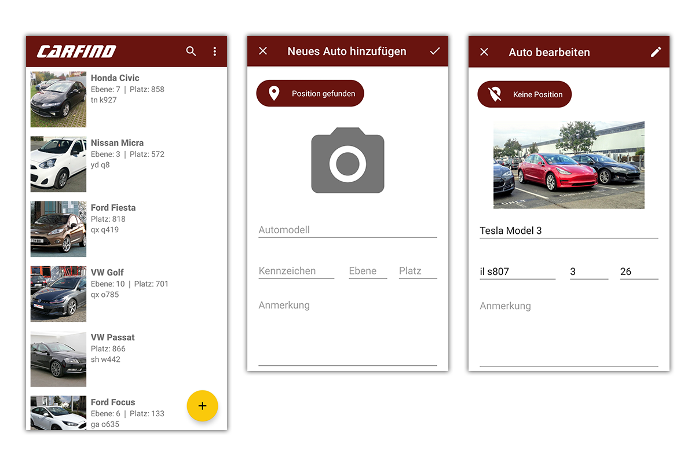

# CarFind
Parked cars can be managed and found with this app. This app is intended primarily for areas such as porters in hotels.
The user can create and save accepted cars with their location, photo, car model, license plate, level, spot and additional notes and use the search function and a GPS intent to navigation apps to find them again later on demand.

## Features
1. Room Database
2. Camera implementation
3. Unit and UI tests
5. Language Support for german and english
6. Dark Mode
7. Android Shortcuts

## Screenshots
  

